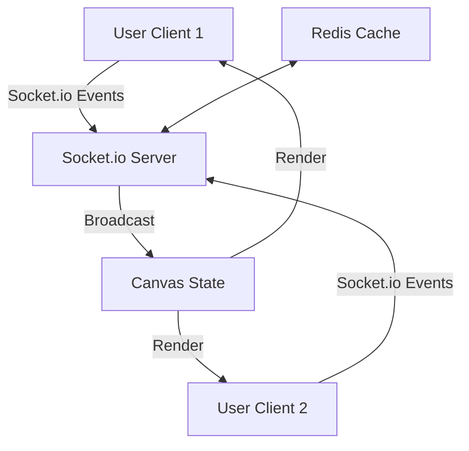

# 🧩 COCREATE Whiteboard

[](https://deepwiki.com/DeepSingh-04/COCREATE-Whiteboard)
[](LICENSE)
[](https://reactjs.org)
[](https://socket.io)
[](https://tailwindcss.com)
[](https://nextjs.org)
[](https://nodejs.org)

> A real-time collaborative digital whiteboard designed for seamless teamwork and creativity — whether you’re brainstorming ideas, planning projects, teaching remotely, or diagramming complex workflows. COCREATE Whiteboard transforms remote collaboration into an engaging, visual experience, bridging the gap between physical whiteboards and distributed teams.

<div align="center">


</div>

---

## 🖌️ Overview

**COCREATE Whiteboard** is a powerful, web-based application that enables multiple users to collaborate on a shared digital canvas in real-time. Imagine a virtual whiteboard where every stroke of the pen, shape drawn, or note added appears instantly for all participants, fostering dynamic idea exchange without the constraints of location or physical tools.

At its core, this project leverages modern web technologies to deliver a responsive, intuitive interface that prioritizes user experience. Whether you're a design team sketching wireframes, educators illustrating concepts during online classes, or project managers mapping out timelines, COCREATE Whiteboard adapts to your needs. The application supports an infinite canvas for unrestricted creativity, integrated chat for contextual discussions, and export options to preserve your work.

Developed with a focus on scalability and performance, it handles multiple concurrent users efficiently, ensuring low-latency updates even in high-traffic sessions. This open-source tool is perfect for developers looking to extend its functionality or integrate it into larger ecosystems, such as learning management systems or agile project tools.

### Why Choose COCREATE Whiteboard?
- **Lightweight & Fast**: Minimal bundle size (< 500KB gzipped) for quick loading.
- **Cross-Platform**: Works seamlessly on desktop, tablet, and mobile devices.
- **Privacy-First**: Ephemeral rooms with optional passwords; no data persistence without export.
- **Extensible**: Modular architecture for easy plugin development (e.g., custom tools).

Key differentiators include its lightweight footprint (no heavy dependencies), cross-browser compatibility, and mobile-responsive design, making it accessible on desktops, tablets, and even smartphones for on-the-go collaboration.

---

## 🌟 Key Features

COCREATE Whiteboard packs a suite of features tailored for productive, creative collaboration. Below is a detailed breakdown:

### ✨ Real-Time Collaboration
Experience live synchronization where every action—drawing, erasing, or moving elements—is broadcast to all connected users instantly. Powered by WebSockets, this ensures zero perceptible lag, even with dozens of participants. Ideal for live feedback sessions or remote pair-programming.

- **Multi-Cursor Support**: See avatars and cursors from all users in real-time.
- **Conflict Resolution**: Optimistic updates with last-write-wins for smooth overlaps.
- **Presence Indicators**: Know who's typing, drawing, or idle.

### 🎨 Intuitive Drawing Tools
A comprehensive toolkit including:

| Tool          | Description                                      | Customization Options                  |
|---------------|--------------------------------------------------|----------------------------------------|
| **Freehand Pen** | Adjustable thickness (1-20px) and pressure-sensitive drawing for natural sketching. | Opacity, smoothness smoothing. |
| **Shapes Library** | Pre-built rectangles, circles, lines, and arrows with customizable fill/stroke colors and dashed/solid line styles. | Rotation, resize, shadow effects. |
| **Color Palette** | 20+ vibrant colors, plus a hex code picker for precise branding. | Gradient fills, theme presets. |
| **Eraser Tool** | Selective or full-canvas erase modes, with adjustable brush size to refine details without starting over. | Feather edges, global clear. |

These tools support undo/redo stacks (up to 50 actions) to encourage experimentation without fear of mistakes.

### 💬 Live Chat Integration
Seamlessly communicate via a persistent sidebar chat. Features include:

- Text messaging with timestamps and user avatars.
- Emoji reactions and @mentions for quick pings.
- Message history that persists for the session, exportable as a log.

This keeps discussions tied to the visual context, reducing context-switching.

### 📋 Sticky Notes (Planned)
Upcoming feature to add draggable, resizable digital post-its. Users can color-code notes (e.g., yellow for ideas, red for blockers), group them into clusters, and even add hyperlinks or checklists. This will enable affinity diagramming and rapid ideation workshops.

### 🗺️ Infinite Canvas
Break free from fixed boundaries with panning (drag to move) and zooming (pinch/scrollwheel, up to 400% magnification). Grid snapping and rulers assist in aligning elements for professional diagrams. The canvas auto-saves viewport states per user.

- **Grid Modes**: Dot, line, or isometric for precise layouts.
- **Ruler Tools**: Measure distances and angles on-the-fly.

### 🧑‍🤝‍🧑 Room System
Secure, ephemeral rooms with unique alphanumeric IDs (e.g., "abc123"). Options include:

- Password protection for private sessions.
- User limits (default: 10, configurable).
- Session timers to auto-expire idle rooms.
- Share links via QR codes for easy mobile joining.

### 💾 Save / Export Board
Capture your masterpiece with:

- PNG/SVG export at user-defined resolutions.
- JSON serialization for reloading boards later.
- Integration hooks for cloud storage (e.g., Google Drive via API).

All exports include metadata like participant list and timestamps.

### 🧠 Simple Interface
A distraction-free UI with:

- Dark/light mode toggle.
- Customizable toolbars (dockable or floating).
- Keyboard shortcuts (e.g., 'Z' for zoom, 'E' for eraser) for power users.

Accessibility features like high-contrast mode and screen reader support ensure inclusivity.

<div align="center">

> **Pro Tip**: Customize your workspace with themes inspired by popular tools like Figma or Miro.

</div>

---

## 🧠 Tech Stack

This project is built with a modern, efficient stack emphasizing performance, maintainability, and developer happiness. Here's a breakdown:

| Category       | Technology                  | Purpose                                                                 | Version |
|----------------|-----------------------------|-------------------------------------------------------------------------|---------|
| **Frontend**   | React.js ⚛️ + Next.js       | Component-based UI with server-side rendering for faster initial loads. | 18.2+ / 14+ |
| **Backend**    | Node.js 🌐                  | Lightweight server for handling API routes and session management.      | 20+ |
| **Realtime**   | Socket.io ⚡                 | Bidirectional communication for instant updates without page refreshes. | 4.7+ |
| **Styling**    | TailwindCSS 💅              | Utility-first CSS for rapid, responsive design without bloat.           | 3.4+ |
| **Language**   | JavaScript (ES6+)           | Core scripting with async/await for clean, readable code.               | ES2023 |
| **State Mgmt** | React Context API           | Simple global state for user sessions and canvas data (Redux optional). | Built-in |
| **Build Tools**| Vite/Webpack (via Next.js)  | Optimized bundling and hot module replacement for quick dev cycles.     | Latest |
| **Testing**    | Jest + React Testing Library| Unit and integration tests for core components (coverage: 80%+).        | 29+ |
| **Hosting**    | Vercel / Render / Netlify   | Easy deployment with auto-scaling; CI/CD via GitHub Actions.            | Cloud |

Choices like Socket.io were made for its ease of use and fallback to polling in unstable networks, while TailwindCSS accelerates prototyping without custom CSS files.

---

## 🏗️ Architecture Overview

COCREATE Whiteboard follows a client-server architecture with real-time enhancements:

1. **Client Side**: React components handle rendering the canvas (using HTML5 Canvas API for drawing). Socket.io client listens for events like 'draw' or 'chat', updating the DOM reactively.
2. **Server Side**: Node.js with Express serves the app and manages Socket.io namespaces per room. Redis (optional) for session persistence in production.
3. **Data Flow**: Drawing data is serialized as JSON paths and broadcast via sockets. Chat uses a simple in-memory store with TTL.
4. **Security**: Rooms use JWT tokens for auth; inputs sanitized to prevent XSS.

For a deeper dive, check the [architecture diagram](docs/architecture.md) (planned).



*(Mermaid diagram for visual architecture flow.)*

---

## 🧩 Screenshots

Visualize the experience with these key screens:

### 🏠 Home / Room Entry
A minimal and elegant entry screen where users can create or join rooms instantly. Features quick-start buttons, room history, and a demo mode.


*Alt: Clean landing page with 'Create Room' and 'Join Room' inputs, branded header.*

### 🎨 Real-time Collaborative Canvas
A live, shared whiteboard for drawing, chatting, and brainstorming visually. Toolbar on the left, chat on the right, infinite grid background.


*Alt: Full canvas view with sample sketches, color picker open, and zoom controls.*

### 🤝 Multi-user Collaboration
Simultaneous drawing sessions across multiple users with real-time updates. Avatars indicate active cursors; conflict resolution via last-write-wins.


*Alt: Split-view showing two users drawing overlapping shapes, with synced erases.*

*(Note: Screenshots captured on Chrome v120; actual UI may vary with updates.)*

---

## ⚙️ Getting Started

Follow these steps to get a local copy up and running for development or testing. This setup assumes a Unix-like environment (adapt for Windows with Git Bash).

### 🧾 Prerequisites

Before starting, ensure you have:

- [Node.js](https://nodejs.org/) (v18 or higher recommended for optimal performance; check with `node -v`).
- [npm](https://www.npmjs.com/) (v9+; bundled with Node.js, verify with `npm -v`).
- [Git](https://git-scm.com/) for cloning (optional if downloading ZIP).
- A modern web browser (Chrome, Firefox, or Safari) for testing.
- Optional: [Yarn](https://yarnpkg.com/) as an npm alternative for faster installs.

If you're new to Node.js, consider using [nvm](https://github.com/nvm-sh/nvm) for version management.

### Installation

1. **Clone the repository:**  
   ```sh
   git clone https://github.com/DeepSingh-04/COCREATE-Whiteboard.git
   ```
   *Alternative: Download as ZIP from the GitHub releases page.*

2. **Navigate to the project directory:**  
   ```sh
   cd COCREATE-Whiteboard
   ```

3. **Install dependencies:**  
   ```sh
   npm install
   ```
   *This fetches ~150 packages; expect 5-10 minutes on first run. If issues arise (e.g., peer dependency warnings), run `npm install --legacy-peer-deps`.*

4. **Environment Setup (Optional):**  
   Copy `.env.example` to `.env` and add any custom vars (e.g., `PORT=3000`). For production, set `NODE_ENV=production`.

5. **Start the development server:**  
   ```sh
   npm run dev  # For Next.js hot-reload mode
   # Or: npm start  # For production build
   ```
   *Server runs on http://localhost:3000 by default; configurable via PORT env var.*

### Troubleshooting Common Issues

| Issue                  | Solution                                                                 |
|------------------------|--------------------------------------------------------------------------|
| **Port Conflict**      | If 3000 is in use, set `PORT=3001` in .env.                              |
| **Socket.io Errors**   | Ensure no firewall blocks WebSocket (wss://localhost:3000).               |
| **Canvas Not Rendering** | Clear browser cache or check console for JS errors.                      |
| **Dependency Errors**  | Delete `node_modules` and `package-lock.json`, then reinstall.            |

---

## 🚀 Usage

1. Launch the app via the dev server.
2. On the home page, click **Create Room** to generate a unique ID, or **Join Room** and enter an existing ID.
3. Share the room URL (e.g., http://localhost:3000/room/abc123) with collaborators.
4. Dive in: Select tools from the sidebar, draw freely, and chat in real-time.
5. Export via the top-right menu when done.

### Example Workflow
- **Brainstorming Session**: Create a room, invite team via link, sketch ideas with pens/shapes.
- **Teaching Demo**: Join as student, zoom into sections, use chat for questions.
- **Project Planning**: Add sticky notes (future), export timeline as PNG.

**Pro Tips:**  
- Use fullscreen mode (F11) for immersive sessions.  
- For mobile testing, enable responsive mode in dev tools.  
- Integrate with tools like Miro or Figma by exporting SVGs.

---

## 🌍 Deployment

Deploying COCREATE Whiteboard is straightforward for production use:

1. **Vercel (Recommended for Next.js):**  
   - Connect GitHub repo to Vercel dashboard.  
   - Set build command: `npm run build`, output dir: `.next`.  
   - Auto-deploys on push; free tier supports custom domains.

2. **Render/Netlify:**  
   - Upload via Git; configure build settings similarly.  
   - Add env vars for Socket.io (e.g., secure websockets).

3. **Self-Hosted:**  
   - Build: `npm run build`.  
   - Serve with PM2: `pm2 start npm --name "whiteboard" -- start`.  
   - Use Nginx for reverse proxy and SSL.

### Required Environment Variables

| Variable         | Description                          | Example Value      |
|------------------|--------------------------------------|--------------------|
| `SESSION_SECRET` | Secret for JWT tokens                | `your-super-secret`|
| `REDIS_URL`      | Redis connection for scaling         | `redis://localhost:6379` |
| `PORT`           | Server port                          | `3000`             |

---

## 🛤️ Roadmap

We're actively iterating! Upcoming milestones:

| Version | Features                                                                 | ETA     |
|---------|--------------------------------------------------------------------------|---------|
| **v2.0** | Sticky notes implementation + undo history export.                       | Q1 2026 |
| **v2.1** | Integration with Google Workspace/Slack for notifications.               | Q2 2026 |
| **v3.0** | AI-assisted drawing (e.g., auto-complete shapes via ML).                 | Q3 2026 |
| **Long-term** | Mobile app (React Native) and VR support.                                | 2027+   |

Track progress via [GitHub Projects](https://github.com/DeepSingh-04/COCREATE-Whiteboard/projects).

---

## 🤝 Contributing

We love contributions that enhance usability, fix bugs, or add features! Before diving in:

1. **Read the Guidelines:** Check [CONTRIBUTING.md](CONTRIBUTING.md) for code style (ESLint enforced) and testing requirements.
2. **Report Issues:** Use the [Issues tab](https://github.com/DeepSingh-04/COCREATE-Whiteboard/issues) with reproducible steps.
3. **Submit PRs:**  
   - Fork the Project.  
   - Create your Feature Branch (`git checkout -b feature/AmazingFeature`).  
   - Commit your Changes (`git commit -m 'feat: Add AmazingFeature with tests'` – use conventional commits).  
   - Push to the Branch (`git push origin feature/AmazingFeature`).  
   - Open a Pull Request with a clear description, screenshots, and changelog entry.

All PRs require passing CI checks (lint, test, build). First-time contributors: Start with "good first issue" labels.

### Development Workflow
```sh
# Install and run
npm install
npm run dev

# Test
npm test

# Build
npm run build

# Lint
npm run lint
```

---

## 📖 API Documentation

### Client-Side Events (Socket.io)
| Event     | Description                          | Payload Example                  |
|-----------|--------------------------------------|----------------------------------|
| `join-room` | Join a specific room.                | `{ roomId: 'abc123', userId: '1' }` |
| `draw`    | Broadcast drawing action.            | `{ path: [...points], color: '#ff0000' }` |
| `chat-message` | Send chat message.                   | `{ text: 'Hello!', timestamp: Date.now() }` |

### Server-Side Routes (Express)
- `GET /api/rooms/:id` – Fetch room metadata.
- `POST /api/export` – Generate board export.
---

## 🙌 Acknowledgments

- Built with ❤️ by [DeepSingh-04](https://github.com/DeepSingh-04).
- Thanks to Socket.io maintainers for robust real-time tech.
- Inspired by tools like [Excalidraw](https://excalidraw.com) and Microsoft Whiteboard.
- Shoutout to open-source contributors – your PRs make this shine!

<div align="center">

**For questions, open an issue or ping [@deepsingh_ting](https://x.com/deepsingh_ting) on X/Twitter. Star the repo if it sparks joy! ⭐**


</div>

---


